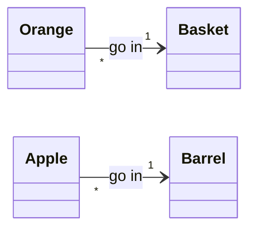

# a
## attribute

Value  which helps  identify  an instance  of  a  class, out  of  all the  other
instances of that class.

Although,  attributes  are not  necessarily  enough  to *uniquely*  identify  an
object.  Indeed, 2 objects instantiated from the same class could have the exact
same attributes (just like  you could have 2 distinct objects  in the real world
with identical physical characteristics).

## association

The most basic way in which instances of 2 classes can be related.

##
# c
## cardinality

See multiplicity.

## class

Conceptually, a kind of related objects.
Technically, it provides a blueprint to create an object of a specific kind.

##
# i
## implementation specification

See OOD.

## instance

A  specific object  created by  a given  class,  with its  own set  of data  and
behaviors.

## instance variable

Synonym for attribute in Python.

## instantiate

Act of creating a new instance based on a given class.

##
# m
## method

Function that is part of a class.

The main difference between a method and a function is that the method is called
using the dot notation `object.method()`.  Also, it has access to the attributes
of any object instantiated from its class.

## member

An object is a member of a class.

##
## model
### cascade/waterfall development model

In this model, the development does not consist of cycles.
The task is fully analyzed, then fully designed, and finally fully programmed.

The iterative model usually works better.

### iterative development model

In this model, the development consists of short cycles.
Each cycle is meant to only implement a small part of the task, and can be split
into 3 stages:

   - analysis
   - design
   - programming

After each  cycle, the result is  reviewed before starting the  next cycle which
implements another small part of the task.

##
## multiplicity

In a class  diagram, number of objects  of a given class that  can be associated
with another given class.  The multiplicity number  of a class is written at the
end of a relationship line/arrow which intersects with that class.

Multiplicity lets you set numerical constraints on relationships.

---

The value of a multiplicity can be:

    ┌──────┬────────────────────────┐
    │ 0..1 │ zero to one (optional) │
    ├──────┼────────────────────────┤
    │ n    │ specific number        │
    ├──────┼────────────────────────┤
    │ 0..* │ zero to many           │
    ├──────┼────────────────────────┤
    │ 1..* │ one to many            │
    ├──────┼────────────────────────┤
    │ m..n │ from m to n (range)    │
    └──────┴────────────────────────┘

---

Example:

Here, the diagram tells us that:

   - many `Orange` objects can go in exactly 1 `Basket` object
   - many `Apple` objects can go in exactly 1 `Barrel` object

##
# o
## OOA

Process of identifying the objects and  interactions between them in the context
of a given task.  The "A" is for Analysis.

For example, suppose the task is:

   > As a botanist, I need a website to help users classify plants so I can help
   > with correct identification

The goal of the  analysis is to produce a set of  required features which should
be enough to achieve the task.  Here, for example, those features could be:

   - *Browse* **Previous Uploads**
   - *Upload new* **Known Examples**
   - *Test* for **Quality**
   - *Browse* **Products**
   - *See* **Recommendations**

In the  previous set, each item  binds an action  (in italics) to an  object (in
bold).

An analysis turns what the client say they want, into an informal description of
the tools they need to do what they want.

## OOD

Process of  converting the requirements  into a  set of classes  and interfaces,
which are called an "implementation specification".  The "D" is for Design.

This implies  that the designer must  name the objects, define  their behaviors,
and specify which objects can activate specific behaviors on other objects.

A design turns an  informal description of the tools that the  client need to do
what they want, into formal specifications for those tools.

## OOP

Programming turns  formal specifications for  tools needed  by the client  to do
what they want into actual code implementing those tools.

If  programming  is  object-oriented,  those formal  specifications  describe  a
collection of interacting objects via their data and behavior.

##
## object

A collection of data with associated behaviors.

##
# p
## private

A method or  attribute is private if, and  only if, it can't be  accessed by any
other class/subclass.

## property

Special kind of attribute.
It has the `__get__`, `__set__` and `__delete__` methods.

<https://stackoverflow.com/a/7377013>

## protected

A method or attribute  is protected if, and only if, it can  only be accessed by
the class to which it belongs, or by one of its subclasses.

## public

A method  or attribute is public  if, and only if,  it can be accessed  by *any*
other class/subclass.

##
# s
## state

The state of an object is implemented via a set of specific attributes.

## subclass

A subclass inherits some of its attributes and/or methods from another class.

Also called a child class.

## superclass

A superclass gives  its attributes and methods to other  classes via inheritance
relationships.

Also called a parent class.

##
# v
## visibility

In a class diagram, sets the accessibility for a method or an attribute:

    ┌────────┬───────────┐
    │ symbol │ meaning   │
    ├────────┼───────────┤
    │ -      │ private   │
    ├────────┼───────────┤
    │ +      │ public    │
    ├────────┼───────────┤
    │ #      │ protected │
    └────────┴───────────┘
