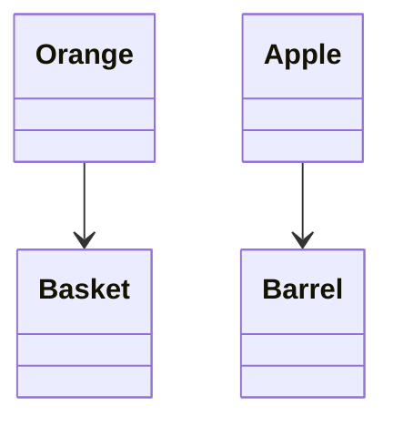

```mermaid
%% specify the type of diagram we want mermaid to render;
%% here, a class diagram
classDiagram

%% the Orange class is somehow associated with the Basket class
Orange --> Basket
%%     ^^^
%% an association  is the  most basic  way for  instances of  two classes  to be
%% related

%% the Apple class is somehow associated with the Barrel class
Apple --> Barrel
```
