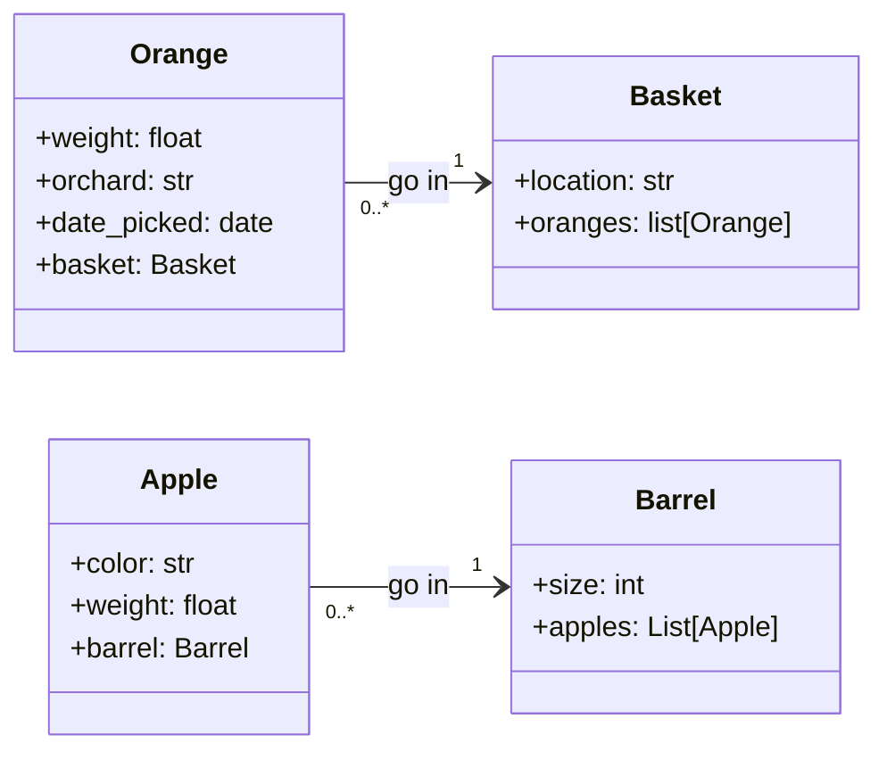

```mermaid
classDiagram
direction LR
class Orange {
    +weight: float
    +orchard: str
    +date_picked: date
    +basket: Basket
}
class Basket {
    +location: str
    +oranges: list[Orange]
}
class Apple {
    +color: str
    +weight: float
    +barrel: Barrel
}
class Barrel {
    +size: int
    +apples: List[Apple]
}
Orange "0..*" --> "1" Basket: go in
Apple "0..*" --> "1" Barrel: go in
```
