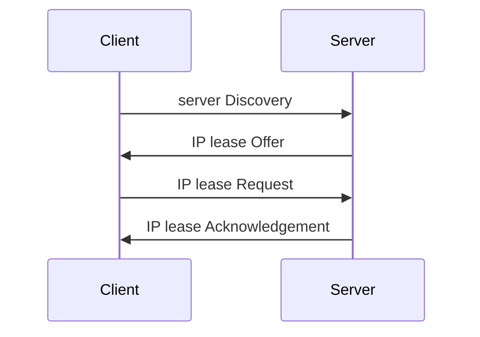

# c
## CIDR (Classless Inter-Domain Routing) notation

A shorthand notation  to represent a subnet, where the  subnet mask is expressed
as its bits length rather than a longer IP.

For example:

              v-----------v
    10.23.2.0/255.255.255.0
    ⇔
    10.23.2.0/24
              ^^

This is  possible because any  subnet mask  should be –  in binary form  – a
sequence of  `1`s followed by  a sequence  of `0`s; which  means that it  can be
entirely defined as the length of its leading `1`s.

##
# d
## DHCP

Dynamic Host Configuration Protocol

Using  DHCP, a  host  can request  an  IP address  on a  network,  and get  some
additional information:

   - subnet mask
   - default gateway
   - DNS servers' IP addresses

In your home, your router (probably a box from your ISP) runs a DHCP server.

## dotted-quad notation

A way of writing an IPv4 address as a sequence of 4 decimal numbers, all between
0 and 255,  separated by dots, which is  easier to read for a  human compared to
the 32 bits processed by a computer.  For example, compare this dotted-quad IP:

    10.23.2.37

To the equivalent in raw bits:

    0b00001010000101110000001000100101

Or in hexadecimal:

    0x0a170225

---

The term is used in several man pages, including `inet(3)`:

   > The form that uses exactly four decimal numbers is referred to as IPv4
   > dotted-decimal notation (or sometimes: IPv4 **dotted-quad notation**).

And `ip-address(8)`:

   > It is a **dotted quad** for IP and a sequence of hexadecimal halfwords separated
   > by colons for IPv6.

## DORA

4 stages of DHCP operations:

##
# e
## encapsulation

As  a data  unit  travels down  the  network  stack to  be  sent, each  protocol
(TCP/UDP, IP,  Ethernet) adds its own  header.  The resulting data  unit becomes
the payload  part of the  one generated by the  next protocol.  This  nesting is
known as encapsulation.  On the receiving machine, the encapsulation is reversed
as the data unit travels back up the network stack.

## endpoint

A type of communication network node.

## Ethernet network

This is the  most common kind of  physical layer.  There are  different kinds of
Ethernet  networks, from  wired to  wireless, but  they all  have two  things in
common: all  their devices  have a MAC  address, and they  all send  messages in
frames.

---

You can't directly transmit a frame  from one Ethernet network to another unless
you set  up an Ethernet bridge.   But you can send  it to a router  A which will
take  the packet  ouf of  the frame,  encapsulate the  latter into  a new  frame
(replacing the MAC addresses from the header),  and send it to the next router B
(which is on the same Ethernet network as  router A, but not on the same as your
host's).

##
# i
## ICMP

Internet Control Message Protocol

It's  a  transport  layer  protocol  used to  configure  and  diagnose  Internet
networks; it can  help you debug connectivity and routing  issues.  For example,
it can:

   - signal a firewall rejecting a packet
   - indicate an overflow in a receive buffer
   - propose a better route for the next packets in the connection

For reference, a receive buffer is a  small memory zone storing data between the
time it arrives from the network and the time the kernel handles it.  If it gets
full, new data can  no longer be received, and ICMP signals  the problem so that
the emitter slows down its transfer rate.

---

`ping(8)` uses ICMP to  send an echo request message to  a recipient host asking
it to answer with an ICMP echo reply message.

---

Although an IPv4 network can work  without ICMP, ICMPv6 is strictly required for
an IPv6  network, since  it combines  several functions that  were, in  the IPv4
world, spread across ICMPv4, IGMP and ARP.

## IPv6 address

An IPv6 address  has 128 bits — 16  bytes, arranged in eight sets  of 2 bytes.
In hexadecimal, it can be written like this:

                   hexadecimal halfword (1 word = 4 bytes, 1 hex digit = 4 bits)
                   v--v
    2001:0db8:0a0b:12f0:0000:0000:0000:8b6e
         ^    ^        ^--------------^
         |    |        a set of contiguous group of `0`s can be abbreviated into `::`
         |    |
         leading `0`s can be omitted

Which can be abbreviated into this:

    2001:db8:a0b:12f0::8b6e
                     ^^
                     can only be used once

---

For the end user,  a subnet is 64 bits long (`/64`), and  the host portion of an
IPv6 is called the interface ID:

              Subnet           Interface ID
        v-----------------v v-----------------v
        2001:db80:8500:e000:52b6:59cc:74e9:8b6e
        ^-----------------^ ^-----------------^
              64 bits             64 bits

---

Hosts normally have at least two IPv6 addresses: the global unicast one, and the
link-local one.   The global unicast address  is valid across the  Internet, and
always starts with `2` or `3`.  The  link-local address is only valid across the
local network, and is always in the `fe80::/64` subnet.

The reason why a global unicast address always starts with `2` or `3` is because
it has the prefix `2000::/3`.  Which means that – in binary – it starts with
`001`.  To get the  first hexadecimal digit, we need one more  bit, which can be
either `0` or `1`.  This gives us either `0010` (`2`) or `0011` (`3`).

---

There is only 1 IPv6 address assigned to the loopback interface: `::1`.

##
# m
## MAC address (aka hardware address)

A MAC address is independent of a host's IP address, and is unique to the host's
Ethernet network (but not necessarily to a larger network such as the Internet).
An example of MAC address is `10:78:d2:eb:76:97`.

MAC stands for Media Access Control.

##
# n
## Network Address Translation (aka NAT)

Default networking mode for a new VM.

It's good enough to  browse the Web, download files, and  view emails inside the
VM.  But it suffers from some limitations, such as the inability to:

   - run a server program (unless you set up port forwarding)
   - connect to another virtual machine in order to simulate a network

## network adapter (aka NIC)

Piece of hardware which lets a machine access a network.

NIC stands for Network Interface Controller.

## network interface

Piece of software which, for a  given network adapter, tells the kernel's device
driver:

   - what is the MAC address of the adapter
   - what is the IP of the host
   - which subnet the host belongs to
   - where to send the frames (via routes)

---

In theory, it can be configured with commands such as:

    $ sudo ip address add <address>/<subnet-mask> dev <interface>
    $ sudo ip route add default via <gw-address> dev <interface>
    $ sudo ip route add <subnet> via <router> dev <interface>

But  in  practice,  it's  more  reliable  to let  a  network  manager  (such  as
`NetworkManager(8)`) do it automatically.

---

At boot time,  network interfaces have names such as  `eth0` (the first Ethernet
card in the  computer) and `wlan0` (for a wireless  interface).  But those names
are unpredictable because they depend on  the order in which the kernel detected
the network devices.

That's  why systemd  quickly  rename  them into  something  like `enp3s0`  which
indicates the kind  of hardware underneath (here, a PCI  Ethernet card).  Such a
name is called a "predictable network interface name".  It's meant to be
more meaningful, and  provide a way to reliably identify  devices based on their
properties or current configuration.

The default  name policy  is defined  by `/lib/systemd/network/99-default.link`.
In practice, a  predictable name often starts with `en`  for wired ethernet, and
`wl` for WiFi.   In the `enp3s0` example,  the rest of the name  indicates a PCI
bus number (`p3`), and a slot number (`s0`).

For more info:

   - `man 5 systemd.link /NamePolicy`
   - `systemd.net-naming-scheme(7)`
   - <https://systemd.io/PREDICTABLE_INTERFACE_NAMES>

## network manager

A tool to automatically configure the network.

In particular,  `NetworkManager(8)` is  the most widely  used on  desktops.  The
main reason  that Red Hat  developed it was  to enable Linux-powered  laptops to
instantly switch back and forth between wired and wireless networks, or from one
wireless domain to another.

If `NetworkManager(8)`  is not installed,  then the OS installer  will configure
`ifupdown`  by   creating  `/etc/network/interfaces`.   In  a   server  context,
`ifupdown` is thus the network configuration tool that you usually get.

`systemd-networkd(8)` can also do basic network configuration for machines which
don't need much flexibility (such as servers).

##
## network stack

A set  of 4 network layers  that any functional  network must have (from  top to
bottom):

   - **application** layer
   - **transport** layer (aka protocol layer)
   - **network** layer (aka Internet layer)
   - **physical** layer (aka link layer)

A layer is a subdivision of a whole network: it's not local to a single machine.
For  example, the  software handling  IP on  all the  machines connected  to the
Internet form a layer: the network layer.

---

I *think* it can also refer to the  software stack used by an OS to send/receive
data over/from the network.

### application layer

Contains the  protocol that applications  and servers use to  communicate (HTTP,
TLS, FTP, ...). Application layer processing occurs in user space.

### transport layer  

This layer includes:

   - data integrity checking
   - source and destination ports
   - specifications for breaking application data into packets at the host side,
     and reassembling them at the destination

TCP and UDP are the most  common transport layer protocols.  The transport layer
and all layers below are primarily handled by the kernel.

### network layer

Defines how to move packets from a source host to a destination host.

IPv4 and IPv6 are the most common network layer protocols.  They're used for the
Internet.

### physical layer

Defines how  to send raw data  across a physical  medium, such as Ethernet  or a
modem.  This is sometimes called the link layer.

##
## `nftables(8)`
### address family

An address family determines the type  of packets which are processed.  For each
address family,  the kernel contains so  called hooks at specific  stages of the
packet processing  paths, which  invoke `nftables(8)` if  rules for  these hooks
exist.

It can be any one of:

   - `ip` (IPv4)
   - `ip6` (IPv6)
   - `inet` (IPv4 + IPv6)
   - `arp`
   - `bridge`
   - `netdev`

See: `man 8 nft /^ADDRESS FAMILIES`.

### table

A table is a container for chains.   It's identified by its name and its address
family.

See: `man 8 nft /^TABLES`.

### chain

A chain  is a  container for  rules.  It exists  in two  kinds: base  chains and
regular chains.

A base  chain is used  when packets  are sent/received (because  it's registered
into the Netfilter hooks).

A regular  chain is not  attached to any  hook so it  does not see  any traffic.
However, it can be used as a jump target for better organization of the rules.

See: `man 8 nft /^CHAINS`.

---

A  base  chain lets  you  set  its policy,  i.e.  what  happens to  packets  not
explicitly accepted or refused in  contained rules.  The supported policy values
are `accept` (which is the default) or `drop`.

### rule

A  rule is  constructed from  two  kinds of  components  according to  a set  of
grammatical rules: expressions and statements.

See: `man 8 nft /^RULES`.

---

For example:
                                                rule
                                          v---------------v
    $ sudo nft add rule inet filter input tcp dport 22 drop
                                          ^----------^ ^--^
                                           expression  statement

Here, `tcp dport 22 drop` is a rule which  drops incoming TCP packets on port 22
(i.e.  it blocks  incoming  SSH  traffic).  It's  constructed  from the  payload
expression `tcp dport 22` and the verdict statement `drop`.

### expression

An expression represents a value.  It can  be a constant like a network address,
a port number, ... or data gathered from the packet during ruleset evaluation.

Expressions can be combined using binary, logical, relational and other types of
operators to form complex or relational (match) expressions.

An  expression  has a  data  type  which,  among  other things,  determines  the
compatibility with other expressions.

See: `man 8 nft /^EXPRESSIONS`.

---

As an  example `127.0.0.1`  is an  expression with the  `IPv4` data  type, while
`ip saddr 127.0.0.1` is  a payload expression (i.e.  it refers to data  from the
packet's payload) of the `IPv4 header` kind.

Similarly,  `22`  is   an  expression  with  the  `Integer`   data  type,  while
`tcp dport 22` is a payload expression of the `TCP header` kind.

### statement

A statement represents an action to be performed.  For example, it can accept or
drop a packet.  It can also alter control flow (e.g. jump to a different chain).

Statements exist in two kinds:

   - terminal statements unconditionally terminate evaluation of the current rule
   - non-terminal statements either only conditionally or never terminate
     evaluation of the current rule

There can be an arbitrary amount of  non-terminal statements in a rule, but only
a single terminal statement as the final statement.

See: `man 8 nft /^STATEMENTS`.

### verdict statement

A  verdict statement  alters  control  flow in  the  ruleset  and issues  policy
decisions for packets. `accept` and  `drop` are special verdict statements: they
are absolute.  That is, they terminate ruleset evaluation immediately.

For  example in  the rule  `tcp dport 22 drop`,  `drop` is  an absolute  verdict
statement.

See: `man 8 nft /^STATEMENTS/;/VERDICT STATEMENT`.

##
# p
## PDU

Protocol Data Unit

It's the smallest unit of information which can be handled by a given protocol.

It consists of a header and a payload.

### segment

PDU for TCP in the transport layer.

Its  header contains  the  source and  destination ports.   Its  payload is  the
application data.

### datagram

PDU for UDP in the transport layer.

Its  header contains  the  source and  destination ports.   Its  payload is  the
application data.

### packet

PDU for the network layer.

Its header  tells where it  came from  and where it's  going.  Its payload  is a
segment or datagram.

### frame

PDU for the physical layer.

Its  header contains  the source  and next-hop  destination MAC  addresses.  Its
payload is a packet.

##
## port

A number  that lets TCP/UDP distinguish  between all applications which  need to
access  the network  simultaneously.   The  client chooses  a  port which  isn't
currently in  use on its side  (arbitrarily), while the server  always uses some
well-known port.

---

Only one process can open a given port  at a time.  But that doesn't mean that a
process can only use a single port.  For example, suppose you run a Web server:

    $ python3 -m http.server 8080 >/dev/null 2>&1 & disown

Then, in Firefox, you visit `http://127.0.0.1:8080` and you ask for a big enough
file (at  least 23 MiB) in  2 tab pages.  For  example, play an audio  file, and
pause it immediately.  Tip: If you only have small files, use `cat(1)` to create
a new one with a bigger size:

    $ cat small.mp3 small.mp3 ... >big.mp3

Finally, you run:

    $ lsof -i 4TCP:8080 -nP | grep firefox

You should see  the same process using  2 sockets with different  ports bound to
the same IP:

                                 an arbitrary port
              v--v     v-------v v--v
    firefox-b 1234 ... 127.0.0.1:5566->127.0.0.1:8080 ...
    firefox-b 1234 ... 127.0.0.1:7788->127.0.0.1:8080 ...
              ^--^     ^-------^ ^--^
              same PID     |     a different arbitrary port
                       same local IP

Also, a process  can re-use the same  port to access the  network multiple times
simultaneously:

    $ lsof -i 4TCP:8080 -nP | grep python
                        v--v
    python3 1234 ... *:8080 (LISTEN)
                               v--v
    python3 1234 ... 127.0.0.1:8080->127.0.0.1:5566 (ESTABLISHED)
    python3 1234 ... 127.0.0.1:8080->127.0.0.1:7788 (ESTABLISHED)
                               ^--^

One might think that it's because here Python starts new threads:

    $ pstree --long --ascii $(pidof -s python3)
    python3---2*[{python3}]
    ^-----^   ^-----------^
       |      threads handling the connections
    thread listening

But if you create an SSH channel for local port forwarding, you can also observe
that a  single `ssh(1)`  process uses  the same  port to  access the  network in
different ways:

    $ lsof -i 4TCP:8000 -nP | grep ssh
    ssh 1234 ... 127.0.0.1:8000 (LISTEN)
    ssh 1234 ... 127.0.0.1:8000->127.0.0.1:5566 (ESTABLISHED)
    ssh 1234 ... 127.0.0.1:8000->127.0.0.1:7788 (ESTABLISHED)

And this time, there are no threads:

    $ pstree --long --ascii $(pidof -s ssh)
    ssh

---

The same port number can be used for an access in TCP, and another in UDP.  IOW,
TCP and UDP have separate port spaces.

## reserved port (aka privileged/system/well-known port)

The ports 1 through 1023 which only processes running as root can use.  All user
processes can listen on and create connections from ports 1024 and up.

##
## privilege separation

A way for a server daemon to protect itself by running only the smallest section
of  its  service  with root  privileges  (for  the  connection  in the  case  of
`sshd(8)`).  Most of  the process runs as an unprivileged  user (for the session
in the case  of `sshd(8)`).  This means that if  an intruder successfully breaks
into the server daemon, he can only do a limited amount of damage to the system.

Additionally, the unprivileged process might  run inside a sandbox.  That's what
`sshd(8)`  does  to restrict  which  syscalls  can  be  called before  the  user
authenticates.

##
## protocol

A set of rules on how computer systems or programs should behave.

### TCP

Transport Control Protocol

TCP is:

   - connection-oriented (a connection is established with a three-way handshake)
   - reliable (no packet is lost)
   - sequenced (packets arrive in the exact order they were sent)
   - duplex (communications can happen in both directions)

---

Once a connection  is established, communications are  **synchronous**: each end
waits on the other to finish transmitting, before replying.  This is enforced by
blocking on  data writes and  on data  reads ("block" =  the program is  made to
wait):

   - data writes block until the data have been received on the other end
   - data reads block until there is incoming data waiting to be read

### UDP

User Datagram Protocol

Contrary  to TCP,  UDP is  connectionless and  best-effort (packets  might never
arrive,  arrive  multiple  times,  or  out  of order).   As  a  result,  it  has
considerably less overhead,  which makes it more suitable when  data needs to be
transported fast.

---

Like with TCP, data reads block until there is incoming data waiting to be read.
But data writes do *not* block.

##
# q
## query string

Part of a URL that assigns values to specified fields, which in turn affects the
appearance of pages, or jump to positions in multimedia content.

For example, consider this URL:

    delimiter between base URL and query string
                                 |
                                 |             delimiter between 2 parameters
                                 v             v
    https://www.youtube.com/watch?v=d-zn-wv4Di8&t=392s
    ^---------------------------^ ^------------------^
              base URL                query string

It contains a query string which can be divided into 2 parameters:

    v=d-zn-wv4Di8
    t=392s

The first parameter specifies which video we want to watch on YouTube.
The second parameter specifies the timestamp from which we want the video to start.

A parameter assigns a value to a field.  For example, `t=392s` assigns the value
`392s` to the field `t`.

The structure of query strings is  not standardized.  Different websites may use
different methods to  parse them.  Although, the ampersand  character is usually
used to separate two parameters inside a single query string.

##
# r
## round robin DNS load balancing

A name server often receives multiple  records in response to a query.  Usually,
it returns  them in a  different order each time  it receives a  query, rotating
them in  round robin fashion.  When  a client receives a  response with multiple
records, the most common behavior is to  try the addresses in the order returned
by the DNS server.  This scheme is  commonly referred to as round robin DNS load
balancing.

You  can  take advantage  of  this  balancing effect  for  your  own servers  by
assigning several  different IP addresses  (for different machines) to  a single
host name:

    www         IN A    192.168.0.1
                IN A    192.168.0.2
                IN A    192.168.0.3

This  should distribute  the  requests  sent to  your  host  name among  several
machines in a fixed rotation order.

## router, gateway

A router is a machine which can move packets from one network to another.  To do
this, it must be attached to more than 1 network.

A gateway is a  router which helps reach out beyond a  local network (towards an
extended network such as the Internet).

##
## route

A route tells  the kernel how to reach  another host when it needs to  send it a
packet.

A route – as given by `$ ip route show` – might look like this:

    192.168.1.0/24 dev enp3s0 proto kernel scope link src 192.168.1.86 metric 100
    ^------------^ ^--------^              ^--------^
          |            |                   where its addresses are valid
          |        network interface to reach it
    destination network

This route says that your host can reach any host on the subnet `192.168.1.0/24`
directly through its  network interface `enp3s0`; there is no  need for a router
to forward packets to the destination.  IOW, your host belongs to that subnet.

---

`scope link` means that this subnet is  a link-local network; i.e. its addresses
are not valid outside the subnet (a router never forwards packets that were sent
to such addresses).  Other possible scopes are `host` and `global`. `host` means
that the addresses are only valid on the host (e.g. `127.0.0.1`), while `global`
means that the addresses are valid across the whole Internet.

---

`proto kernel`  means  that  the  route  was  installed  by  the  kernel  during
autoconfiguration.

---

`src 192.168.1.86` means  that `192.168.1.86` is  the preferred address  to send
from when sending packets to the destination network.

---

`metric 100` assigns a priority to the route:

   > metric NUMBER
   >        priority of prefix route associated with address.

Source: `man 8 ip-address /^\s*metric`

If 2  routes match  a given destination,  and have the  same metric,  the kernel
chooses  the one  with the  longest  prefix.  The  order of  the routes  doesn't
matter.

For  example, suppose  you want  to send  a packet  to `192.168.1.123`,  and the
latter matches 2 routes:

    default via 192.168.1.254 dev enp3s0 ... metric 100
    192.168.1.0/24 dev enp3s0 ... metric 100

The prefix of `192.168.1.0/24` is 24  bits long, while the prefix of `0.0.0.0/0`
(aka default) is 0 bits long (i.e. it  has no prefix).  The second route has the
longest prefix, thus it takes priority.

### default route

Route  for the  destination  `0.0.0.0/0`  (`::/0` in  IPv6),  which matches  any
address on the Internet.  It might look like this:

    default via 192.168.1.254 dev enp3s0 proto dhcp metric 100
            ^---------------^ ^--------^
                    |         on which interface
                    |
            where to sent traffic (aka default getway)

When no other rules match, the default route always does.

### default gateway

Where you send messages when there is no other choice.  It's the intermediary in
the default route.  For example:

    default via 192.168.1.254 dev enp3s0 proto dhcp metric 100
            ^---------------^

You can  configure a host  without a  default gateway, but  it won't be  able to
reach hosts outside  the destination networks in its routing  table (as given by
`$ ip route show`).

##
# s
## sequence/acknowledgment number

Numbers carried by the TCP header in a packet sent to a host.
Their purpose is to let the opposite host:

   - re-order the received packets in case they arrive out-of-order

   - ask the opposite host to re-transmit a packet if it was lost during its
     transport over the network

At the start of a TCP connection, each host initializes a sequence number in the
first SYN packet that they send (during the three-way handshake).
Afterward, they increment their  sequence number by 1 when they send  a SYN or a
FIN packet; otherwise, if they send a  packet with a TCP payload, they increment
by the byte size of the latter.

As for the acknowledgment number, it  should always match the sequence number of
the next packet  sent by the opposite  host (except in the very  first SYN where
it's 0, because  the client doesn't know  yet the random number  that the server
will choose as an initializer).

## SFTP

It's the SSH File Transfer Protocol; not FTP over SSH or SSL.

`sftp(1)` is a program implementing this protocol.

##
## (network) socket

A  kind of  software structure  – created  with `socket(2)`  – which  lets a
process (running in user space) access the network (through the kernel).

Data  written to  a  socket  via `write(2)`/`send(2)`  are  turned into  network
packets that  get sent out,  and packets received from  the network can  be read
from a socket via `read(2)`/`recv(2)`.

---

A socket is a *bidirectional* means of communication, which is why it's accessed
with the `u` mode in the output of `lsof(8)`:

    $ sudo lsof -i -nP | sed -n '2p'
    systemd 1 ... 123u ... TCP *:111 (LISTEN)
                     ^

    $ sudo lsof -i -nP \
        | awk 'NR > 1 { sub(/^[0-9]+/, "", $4); print $4 }' \
        | sort --unique
    u

But it's still specific to a *single*  process; you can't find a process writing
on a given socket and another reading from that same socket.  A socket is like a
phone: if two people want to talk over the phone, they each need their own.  But
a phone is still  bidirectional: you can talk to it *and* you  can listen to it.
Same thing with processes: they each need their own socket, which they can write
to *and* read from.

---

While a socket can be bound to a local IP address with `bind(2)`:

    $ sudo lsof -i -nP -w | grep -v '*' | sed -n '2p'
    systemd-r  389  systemd-resolve  12u  IPv4  22977  0t0  UDP 127.0.0.53:53
                                                                ^--------^

I don't think it's a requirement:

    $ sudo lsof -i -nP -w | grep '*' | head --lines=1
    systemd  1  root  34u  IPv4  15963  0t0  TCP  *:111 (LISTEN)
                                                  ^

There is no IP address here.

## Unix (domain) socket

A Unix domain socket behaves for the most part like a network one.

However, contrary to a network socket:

   - it is only used for interprocess communication (IPC) (i.e. connect
     2 processes on the same machine)
   - it doesn't need access to the network
   - it can optionally be bound to a socket file

---

A Unix socket provides better performance  than a network one because it doesn't
attempt to use any network resources at all.

Also, it provides better security, because it doesn't interact with the network;
and it  can optionally be bound  to a socket file,  in which case a  process can
only use it if its permissions allow it to access the file.

---

While it's true that a Unix socket *can* be bound to a socket file:

                                   last but one field (NODE)
                                   v-----v
    $ sudo lsof -U -nP -w | grep ' [0-9]\+ /' | head --lines=1
    systemd  1  root  12u  unix  0xffff9b6c84dd4c80  0t0  107381  /run/systemd/journal/stdout type=STREAM
                                                                  ^-------------------------^
                                                                        some file path

That's not a requirement:

    $ sudo lsof -U -nP -w | grep ' [0-9]\+ type=' | head --lines=1
    systemd  1  root  17u  unix  0xffff9b6d8216fb40  0t0  17729  type=DGRAM
                                                                ^
                                                                no file path

A process can create an *unnamed* Unix socket and share the address with another
process.

##
## spoof server

An  intruder who  controls  a server  can  make it  spoof  a different  server's
identity (by copying the login prompt, the web site, the OS version, ...). Every
user that logs onto the **spoof server**  gives his username and password to the
intruder.  This is called spoofing.

Often the intruder will then forward the session to the actual destination host,
so that  the user  never realizes  that their  credentials have  been disclosed.
This is called a MITM attack.

##
## OpenSSH

It's the  most widely deployed  implementation of the  SSH protocol, and  is the
standard  SSH implementation  in  the Linux  and  BSD world.   It  comes in  two
versions, OpenBSD and Portable OpenSSH.

The OpenBSD version is small and secure, but only supports OpenBSD.

The  OpenSSH Portability  Team  takes  the OpenBSD  version  and  adds the  glue
necessary to  make OpenSSH  work on other  operating systems,  creating Portable
OpenSSH.   Indeed,   different  operating   systems  use   different  compilers,
libraries, authentication systems, ...

## SSH

SSH stands for "Secure SHell".

It's a  protocol for  creating an encrypted  communications channel  between two
networked hosts.  SSH  protects data passing between two machines  so that other
people cannot eavesdrop on it.

It was designed  to replace insecure protocols such as  telnet, RSH, and rlogin.
Many software packages rely on it for encrypted and well-authenticated transport
of data across private, public, and hostile networks.

## SSH agent

It's useful  if you  frequently authenticate  to a  server with  a key  which is
encrypted by a passphrase.  Thanks to  the `ssh-agent(1)` daemon, you don't need
to provide the same passphrase for every SSH session; just once.  Afterward, the
agent loads your decrypted private key  in its memory, and processes all private
key operations on behalf of `ssh(1)`.

If a process needs to communicate  with the agent (`ssh(1)`, `ssh-add(1)`, ...),
they read  `$SSH_AUTH_SOCK` to find  the socket over  which they can  send their
requests.

---

Your desktop environment probably starts one automatically whenever you log in a
graphical session, and terminates it when you log off (that's what XFCE does).

In XFCE, it's a child of `xfce4-session(1)` which itself is a child of `lightdm(1)`.

It might be started in various ways:

   - as a systemd service:

         $ systemctl --user list-unit-files --type=service --no-legend '*ssh*'
         gnome-keyring-ssh.service            static   enabled
         ssh-agent.service                    static   enabled

   - by an autostarted `.desktop` file
     (e.g. `/etc/xdg/autostart/gnome-keyring-ssh.desktop`)

   - as part of the `/etc/X11/Xsession` script (see `man 5 Xsession` and
     `/etc/X11/Xsession.d/90x11-common_ssh-agent`); see also `use-ssh-agent` in
     `/etc/X11/Xsession.options`

But on our machine, it starts even  when we disable all those methods.  It might
be hard-coded in `xfce4-session(1)`:

    $ strings /usr/bin/xfce4-session | grep -i ssh-agent
    /startup/ssh-agent/enabled
    /startup/ssh-agent/type
    ssh-agent
    GNOME compatibility is enabled and gnome-keyring-daemon is found on the system. Skipping gpg/ssh-agent startup.
    Failed to kill ssh-agent with pid %d

Which would explain why we can't terminate it (even with `$ kill -9`).

---

You might be prompted for your passphrase during the login process:

   > Most display managers, like xdm and kdm , have hooks to automatically
   > check for SSH keys in the user’s home directory. When the display manager
   > finds a key during the logon process, it creates a pop-up window to request
   > your passphrase. Enter the passphrase and the display manager attaches the
   > SSH agent to your desktop environment. You’re ready to begin work.

Source: the "SSH Mastery" book.

But we aren't ATM.  You might need to install an askpass program:

    $ sudo apt install ssh-askpass

And you  might need to set  `$SSH_ASKPASS` to the  latter (not sure how  or from
which file).

In any case, I don't want to be prompted:

   - in a GUI pop-up (only in a terminal)

   - automatically as soon as we log in (only on-demand, when we're ready to
     start working on a remote server)

## SSH certificate

An SSH certificate is used for user or host authentication.  It consists of:

   - a public key
   - some identity information
   - zero or more principal (user or host) names
   - a set of options
   - a signature by a Certification Authority (CA) key

Clients or servers can  be configured to only trust a single  CA key, and verify
its signatures on certificates, rather than having to trust many user/host keys.
And it's easier to guarantee the security  and authenticity of a single key than
many.

Besides, certificates bring a few other benefits:

   - host certificates let you renew host keys often (even every day),  without
     annoying users  with  prompts asking  them  to trust  the  new keys (if you
     annoy them too often, they'll learn to ignore the prompts and blindly trust
     any key, which is bad for security)

   - users no longer need to append their keys to `authorized_keys` on the
     remote (which requires either password-based authentication to remain
     available, or to send the keys to a sysadmin who will have to append them);
     user certificates remain on clients' machines

   - user certificates' identities can be used to let people log in as root, but
     still retain user accountability

---

Contrary to a host/user authentication key, a certificate can be made to expire.

Note that you  can set the option `expiry-time` for  a given user authentication
key in `authorized_keys`, but that's not  an intrinsic property of the key (i.e.
you can  reset the expiration date  without touching the key,  simply by editing
the `authorized_keys` file).

---

Certificates don't make host/user authentication  keys obsolete.  You still need
them.  And their  private keys can still be compromised  (when that happens, you
still need to revoke the corresponding public keys).

What  certificates   *can*  make   obsolete  are  the   *user*  caches/databases
`known_hosts` and `authorized_keys`.  Although, you still need new *system-wide*
files with a similar purpose for the CA keys.

---

SSH CAs are an OpenSSH extension.  Other clients have not yet adopted them.

##
## subnet

A  connected group  of hosts  (usually  on the  same physical  network) with  IP
addresses in a particular range.

A subnet can be expressed as a network prefix and a subnet mask.  For example:

    10.23.2.0/255.255.255.0
    ^-------^ ^-----------^
        |      subnet mask
    network prefix

Or, in CIDR notation:

    10.23.2.0/24
              ^^

Together, the prefix and the mask give  you all possible IP addresses on a given
subnet.

---

Your subnet can be obtained by running:

    $ ip address show | awk '/inet.*brd/ { print $NF, $2; exit }'
    enp3s0 192.168.1.86/24

Note that in this  address, some bits are set in the host  portion (here, in the
last `.86`).  That's because it actually  combines a subnet (yours) *and* the IP
of a particular host on that subnet (again, yours).

### network prefix

The  part that  is common  to  all addresses  in  a given  subnet (when  they're
expressed in  binary form).  A  network prefix  can be expressed  in dotted-quad
notation for IPv4, or as a sequence of hexadecimal halfwords separated by colons
for IPv6.

### subnet mask

A sequence  of `1`s followed  by a  sequence of `0`s,  where each `1`  marks the
location of a  bit which is common to  all IP addresses in a  given subnet (i.e.
all of them have the same bit in that location).

Given an IP, without the associated mask, we don't know where the network prefix
ends (note that it could end with 0,  1 or more `0`s) and where the host portion
starts.

##
# t
## three-way handshake

Exchange of SYN and ACK packets between a client and a server to establish a TCP
connection:

   - the client sends a SYN packet to the server
   - the server responds by sending a SYN-ACK to the client
   - the client responds by sending an ACK to the server

A SYN/ACK packet has the SYN/ACK flag set in its TCP header.

## TTL

The Time To Live field of an  IP packet represents the maximum number of routers
that it can  go through before being  thrown away.  Each router  on the Internet
decrements the TTL field by one.

##
# u
## uplink

Connection between a router and a WAN; the router being also connected to a LAN.
Such a  router links a small  LAN to a larger  WAN: all machines on  the LAN can
access the WAN via the router.

##
# w
## WAN

Wide Area  Network: a geographically  dispersed collection  of LANs that  span a
large distance.  The Internet is the largest WAN, spanning the globe.

Contrary to a LAN, usually, no one owns a WAN.  Rather, its ownership/management
is shared/distributed.   Also, a WAN can  carry a signal using  various methods,
including fiber-optic cables, wireless transmissions, and satellites.
